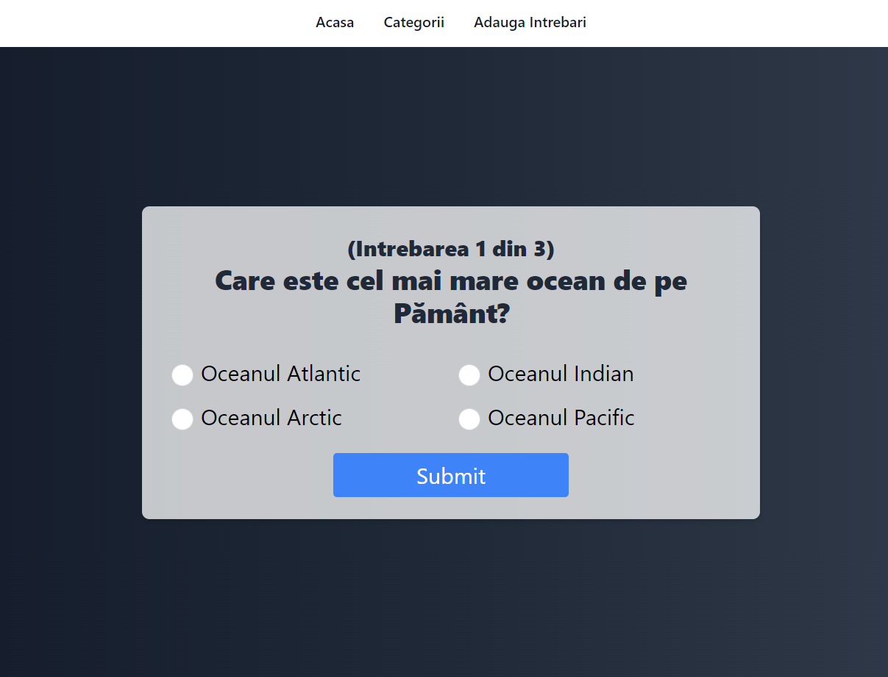

# <span style="color: green;">Chestionar de Cultură Generală</span>

Acest proiect este un chestionar de cultură generală dezvoltat folosind [Next.js](https://nextjs.org/). Acesta oferă utilizatorilor o serie de întrebări cu răspunsuri multiple pentru a le testa cunoștințele în diverse domenii.
diverse domenii.

Proiectul utilizează [Tailwind CSS](https://tailwindcss.com/) pentru stilizare rapidă și eficientă.



## Începe

Pentru a porni serverul de dezvoltare cu Node, rulează:

```bash
npm i
# Instalează dependencies
npm run dev
# Pornește serverul
```

Deschide http://localhost:3000 în browser pentru a vedea rezultatul.

Poți începe editarea paginii modificând app/page.js.

### Funcționalități:

- Întrebări cu răspunsuri multiple

- Sistem de scor pentru a urmări performanța utilizatorului

- Rutare dinamică pentru întrebările chestionarului

## Contribuții

Contribuțiile sunt binevenite! Dacă dorești să contribui la acest proiect, urmează acești pași:

1. Fork la acest repo
2. Creează o ramură nouă (`git checkout -b feature/noua-funcționalitate`)
3. Fă commit pentru schimbările tale (`git commit -m 'Adaugă funcționalitatea X'`)
4. Fă push pe ramura ta (`git push origin feature/noua-funcționalitate`)
5. Deschide un Pull Request

## Licență

Acest proiect este licențiat sub Licența MIT. Vezi fișierul [LICENSE](./LICENSE) pentru mai multe detalii.
